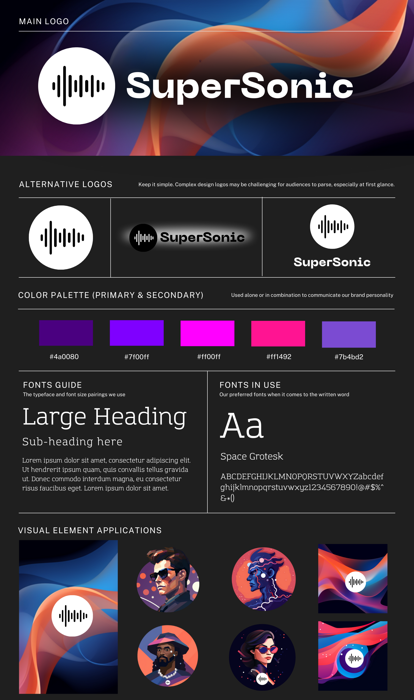

### **Branding Guide for SuperSonic**

## 🎨 Branding Board

### **Core Identity**

- **Tagline:** *Revolutionizing Sonic DeFi with AI-Powered Agent Swarms*
- **Brand Voice:**
    - Dynamic and accessible, tailored to DeFi users of all levels.
    - Informative yet conversational, bridging the gap between technical depth and user simplicity.

---

### **1. Logo Design**

- **Main Logo:**
    - Combines a modern wordmark "SuperSonic" with a distinctive sonic wave symbol
    - Wave symbol represents speed, efficiency, and the flow of interconnected AI agents
    - Clean, bold typography with excellent readability

**Alternative Logos:**
- Circular icon-only version for small spaces and avatars
- Horizontal lockup with gradient effect
- Symbol with standalone wordmark for flexible applications

Keep it simple. Complex design logos may be challenging for audiences to parse, especially at first glance.

---

### **2. Color Palette**

**Primary Colors:**
- Sonic Blue (#0066ff)
- Electric Blue (#00ffff)
- Vibrant Cyan (#00e6e6)
- Deep Blue (#0044cc)
- Soft Blue (#4d94ff)

These colors can be used alone or in combination to communicate our brand personality. The gradient combinations create dynamic, energetic visuals that represent our innovative approach to DeFi.

---

### **3. Typography**

**Primary Font: Space Grotesk**
- Used for all primary text elements
- Complete character set: ABCDEFGHIJKLMNOPQRSTUVWXYZabcdefghijklmnopqrstuvwxyz1234567890!@#$%^&*()

**Font Applications:**
- Large Headings: Space Grotesk Bold
- Sub-headings: Space Grotesk Medium
- Body Text: Space Grotesk Regular

The typeface provides a modern, technical feel while maintaining excellent readability across all sizes.

---

### **4. Visual Element Applications**

Our visual language includes:
- Sonic wave patterns in brand colors
- Speed-inspired geometric compositions
- Gradient overlays and color transitions
- Tech-inspired illustrations and avatars
- Consistent use of the wave symbol in various applications

Key Applications:
- Background patterns and textures
- Hero images and banners
- Profile pictures and avatars
- Decorative elements and dividers

All visual elements should maintain our core aesthetic of being modern, technical, and approachable while incorporating our signature color palette and design motifs. The visual language should evoke a sense of speed, efficiency, and technological advancement, aligning with the Sonic blockchain's high-performance characteristics.