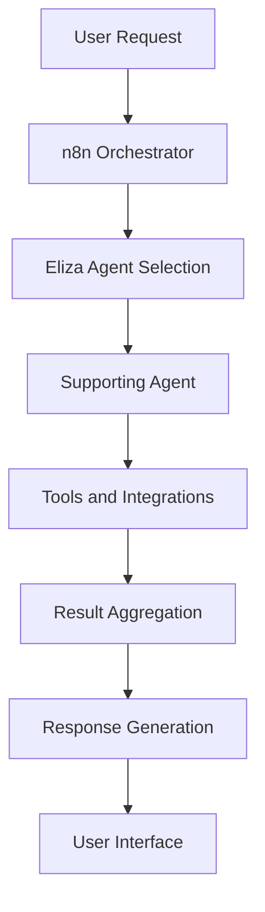

# Multi-Agent System Architecture 🤖

SuperSonic's power comes from its innovative Multi-Agent System (MAS) architecture, where multiple AI agents work together harmoniously to deliver a comprehensive DeFAI experience. This document explains how our MAS works and why it's a game-changer for DeFi operations. Want to see our agents in action? Check out our [User Guide](./user-guide.md) or explore our complete [Agents Directory](./agents.md).

## Why Multi-Agent Systems? 🎯

Traditional DeFi tools often use single-purpose bots or monolithic systems. Our multi-agent approach offers several key advantages:

- **Specialization**: Each agent excels at specific tasks, leading to better performance
- **Redundancy**: Multiple agents can handle similar tasks, ensuring system reliability
- **Scalability**: New agents can be added without disrupting existing operations
- **Flexibility**: Agents can be updated or replaced individually
- **Emergent Intelligence**: Agents collaborate to solve complex problems

## Our Agent Architecture 🏗️

### Core Components

1. **Orchestration Layer**
   - n8n as the primary coordination and orchestration system.
   - ElizaOS as the main agentic framework for protocols and tools integration.

2. **Agent Types**
   - Internal
   - Public
   - Private

### Communication Flow

## ElizaOS Integration 🔄

ElizaOS serves as our primary agentic framework, providing:

- Agent Runtime
- Clients Integration
- Plugins Integration
- On-Chain Features

## n8n Workflow Automation 🔧

n8n powers our automated workflows and agent orchestration, handling:

- Agent trigger conditions
- Data transformation
- API integrations
- Error handling
- Task scheduling

## Future Developments 🚀

We're continuously evolving our MAS with:

- Advanced AI models integration
- Enhanced collaboration patterns
- Improved learning capabilities
- New agent specializations
- Extended protocol support

## Getting Started with MAS Development 💻

For developers looking to extend our MAS:

1. Review our [Developer Quick Start](./quick-start.md)
2. Explore [ElizaOS Plugin](./plugin.md) documentation
3. Study [n8n Workflows](./n8n.md) examples
4. Check [Deployment Options](./deployment.md)

## Additional Resources 📚

- [System Overview](./system-overview.md)
- [Agents Directory](./agents.md)
- [Integrations](./integrations.md) 